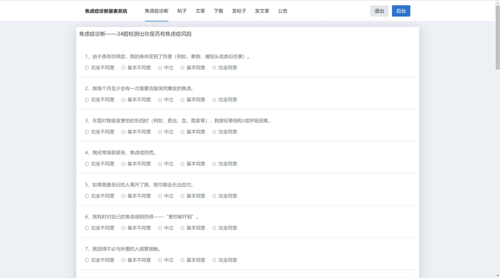
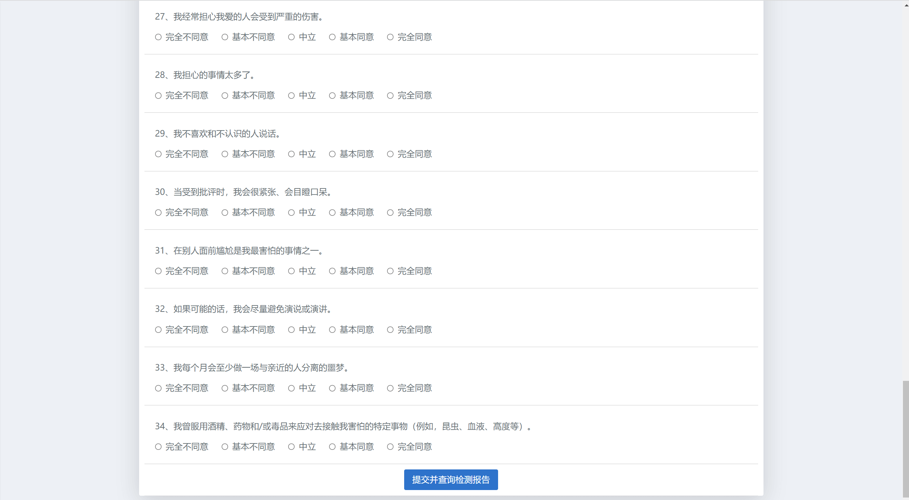
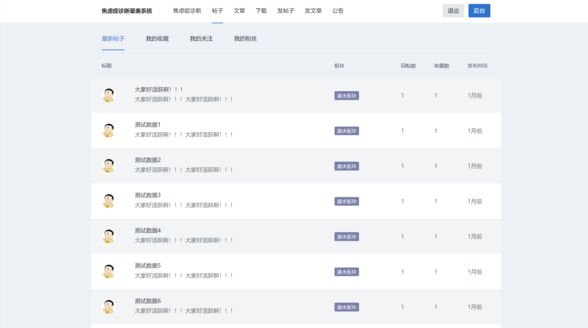
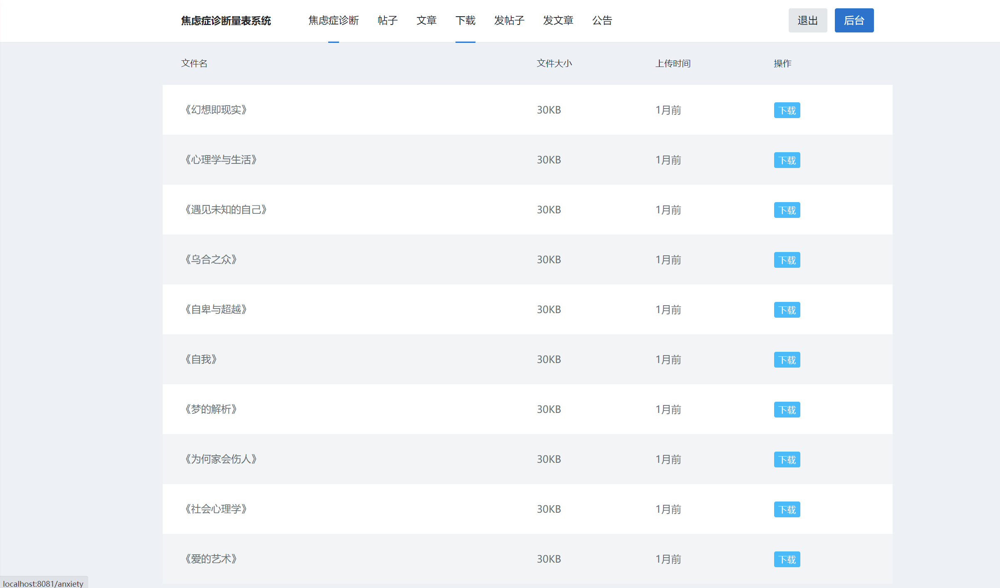
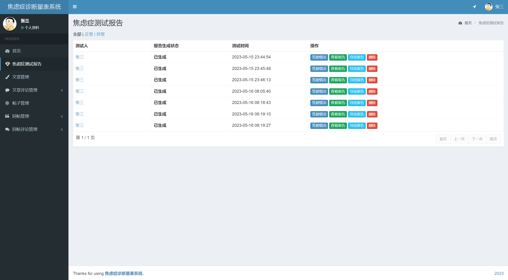
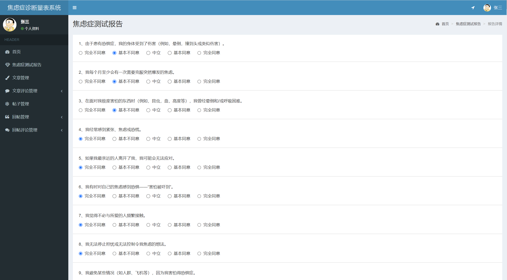
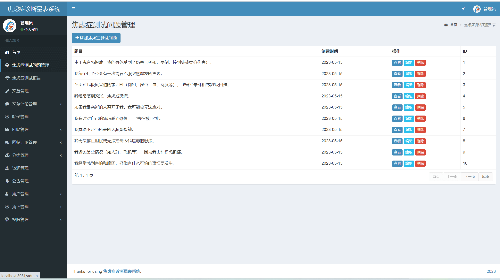
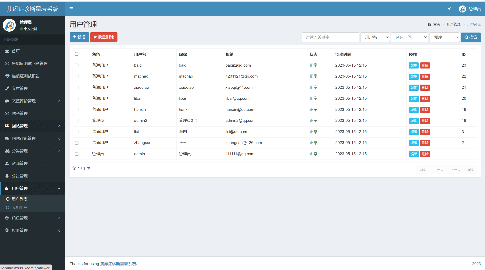

2023 SpringBoot 焦虑症检测系统 焦虑症交流论坛 心理交流论坛
- 预览地址：待部署
- 预览地址：[https://liuyanzhao.com/shop/anxiety-system.html](https://liuyanzhao.com/shop/anxiety-system.html)

## 一、功能介绍
- 包含用户和管理员两个角色，可以在后台自定义角色和权限

#### 用户功能：
- 提交焦虑症自测答案
- 后台查看焦虑症检测报告、导出下载PDF报告、查看答题结果
- 文章管理
- 文章评论管理
- 帖子管理
- 帖子回帖管理
- 帖子回帖评论管理
- 个人信息管理、密码修改
- 下载资源
- 帖子查看，我的收藏，我的关注，我的粉丝，用户主页......

#### 商家功能：
- 管理焦虑症自测题
- 查看焦虑症答题结果、查看报告、导出PDF报告等
- 所有文章管理
- 所有文章评论管理
- 所有帖子管理
- 所有帖子回帖管理
- 所有帖子回帖评论管理
- 资源管理
- 分类管理(文章分类和帖子分类)
- 用户管理
- 角色管理和权限管理
- 以及用户的所有权限

## 二、技术组成
- SpringBoot
- MyBatis
- Thymeleaf
- MySQL

## 三、项目截图

## 四、联系方式
需要完整代码联系博主，微信847064370

